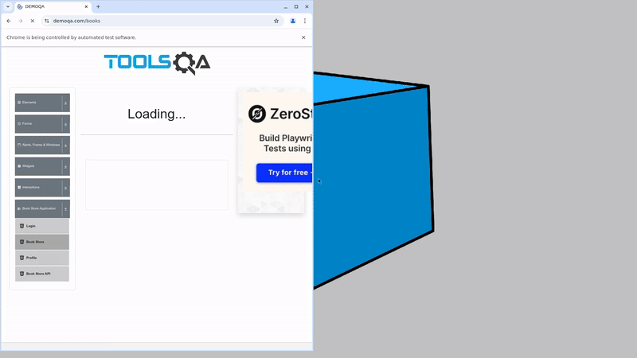

<h1> Проект по тестированию сервиса "Book Store Application" (ToolsQA) </h1>

> <a target="_blank" href="https://demoqa.com/books">Ссылка на сайт</a>

---
<h3> Список проверок, реализованных в автотестах:</h3>

### UI-тесты

✅ Открытие страницы Book Store  
✅ Поиск книги по точному названию  
✅ Поиск книги по части названия  
✅ Поиск книги по автору  
✅ Поиск книги по несуществующему значению

### Проект реализован с использованием:

---

###  Запуск проекта в Jenkins

### [Задача в jenkins](https://jenkins.autotests.cloud/job/Qa_guru_hw_14_daria_belevtseva/)

#### Для запуска автотестов в Jenkins

1. Открыть [Проект в Jenkins](https://jenkins.autotests.cloud/job/qa_guru_hw_14_daria_belevtseva/)
2. Выбрать пункт `Build with Parameters`
3. Выбрать тип запускаемых тестов в выпадающем списке Type_of_tests(ui, api, mobile)
4. Выбрать контекст запускаемых тестов в выпадающем списке context(remote_web, bstack, api)
5. Указать версию браузера, по умолчанию стоит 122
6. Нажать кнопку `Build`
7. Результат запуска сборки можно посмотреть в отчёте Allure
   

---

###   Allure отчет

#### Общие результаты

#### Список тест кейсов

#### Пример отчета о прохождении ui-теста

Отчет позволяет получить детальную информацию по все шагам тестов, включая скриншоты, log - файлы и видео о прохождение
теста(набор атач файлов зависит от типа тестов), а так же позволяет оперативно понять причину падения теста.

---

###  Интеграция с Allure TestOps

### [Dashboard](https://allure.autotests.cloud/project/5041/dashboards)

Дашборд с результатами о прохождении тестов.

#### Общий список всех кейсов, имеющихся в системе

#### Пример отчёта выполнения одного из автотестов

#### История запуска тестовых наборов

---

###  Интеграция с Jira

[Ссылка на проект в Jira](https://jira.autotests.cloud/browse/HOMEWORK-1558)

---

###  Оповещение о результатах прогона тестов в Telegram

---

###  Пример видео прохождения ui-автотеста

