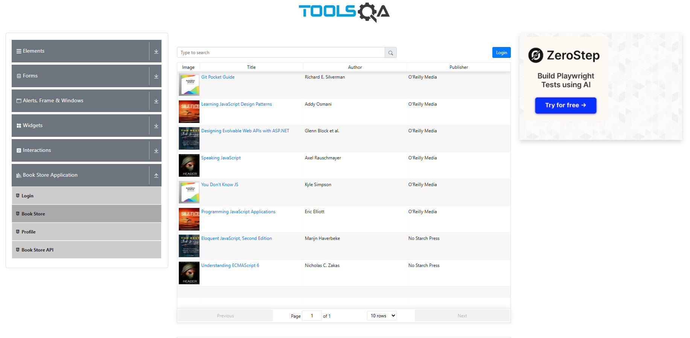

<h1> Проект по тестированию сервиса "Book Store Application" (ToolsQA) </h1>

> <a target="_blank" href="https://demoqa.com/books">Ссылка на сайт</a>

<h3> Список проверок, реализованных в автотестах:</h3>

### UI-тесты
✅ Открытие страницы Book Store  
✅ Поиск книги по точному названию  
✅ Поиск книги по части названия  
✅ Поиск книги по автору  
✅ Поиск книги по несуществующему значению  

---

### Проект реализован с использованием:

